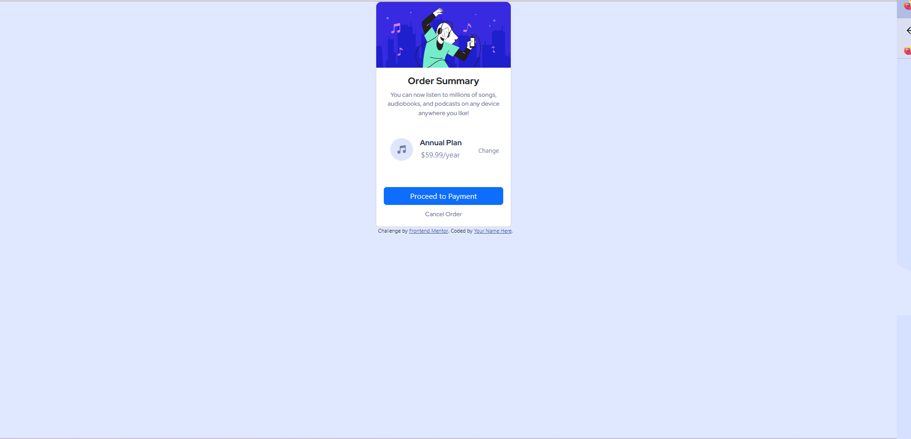

# Desafio Frontend Mentor - "Frontend Mentor - Order summary card solution"

Essa é uma solução para o desafio "Front End Mentor" [Order summary card challenge on Frontend Mentor on Frontend Mentor](https://www.frontendmentor.io/challenges/order-summary-component-QlPmajDUj). 

## Índice

- [Visão Geral](#visão-geral)
- [Screenshot](#screenshot)
- [Links](#links)
- [Feito com](#Feito-com)
- [O que aprendi](#o-que-aprendi)
- [Autor](#autor)

## Visão Geral

- Your challenge is to build out this order summary card component and get it looking as close to the design as possible.

## Screenshot

## Links

- Solution URL: [Solução] (https://www.frontendmentor.io/solutions/order-summary-component-RBKUzZfwA_)
- Live Site URL: [Live Site](https://falcettijr.github.io/order-summary-component-main/)

## Feito com

- HTML5 
- CSS 3 
- Figma
- Bootstrap

## O que aprendi

Nesse projeto eu treinei minha habilidades em HTML, CSS3, Figma e Bootstrap 5.

## Author

- Website - [Sergio Falcetti](https://beacons.ai/sergiofalcetti)
- Frontend Mentor - [@falcettijr](https://www.frontendmentor.io/profile/falcettijr)
- Git-Hub - [@falcettijr](https://github.com/falcettijr)
 
